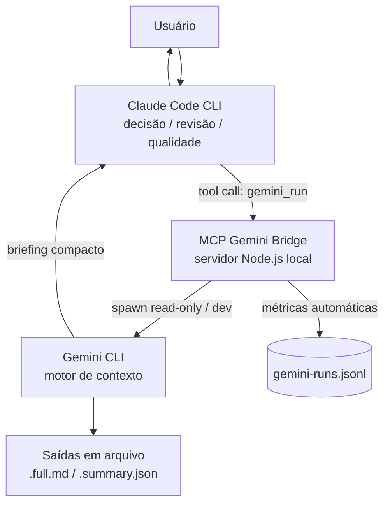
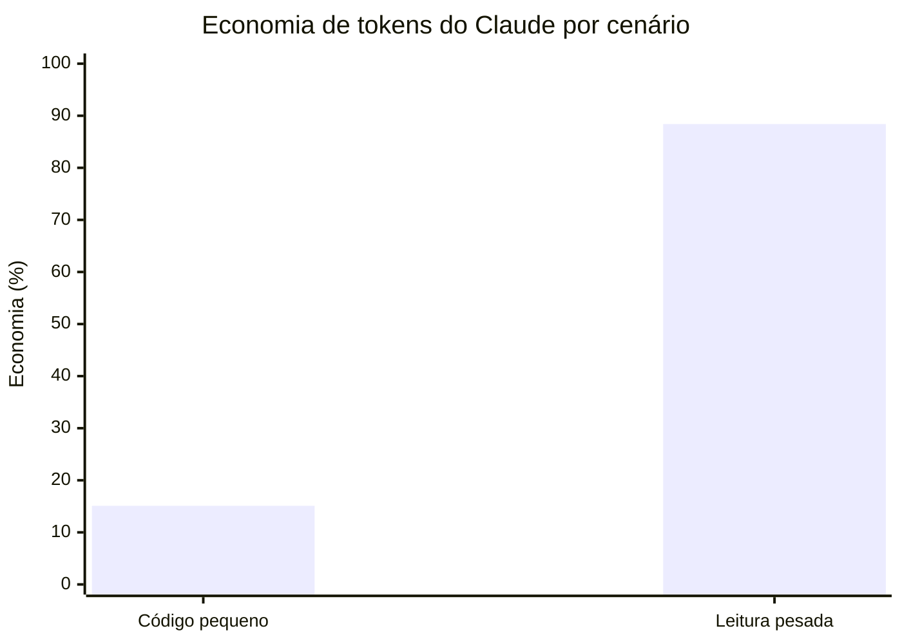

# Context Bridge Lab — MCP Gemini Bridge

> Laboratório operacional que integra **Claude Code CLI** e **Gemini CLI** por meio de um
> servidor **MCP (Model Context Protocol)** local.
>
> **Status:** Experimental / Lab — parcialmente validado por testes A/B.

## Resumo

O Context Bridge Lab cria um fluxo de trabalho em que o **Claude** atua como responsável técnico
(decisão, revisão, segurança) e o **Gemini** atua como **motor de contexto**: leitura pesada,
pesquisa, análise de repositórios, documentação e — quando fizer sentido — apoio de implementação.

O objetivo não é apenas "usar dois modelos", e sim **reduzir a carga operacional do Claude e
aumentar a produtividade líquida**, mantendo revisão, segurança e rastreabilidade.

> Mensagem principal: o maior valor não é "o Gemini codar tudo", e sim **"o Gemini ler tudo"**.
> O Gemini é o **motor de contexto**; o Claude é o **motor de decisão, revisão e qualidade**.

Este projeto **não substitui** Claude, Cursor ou Gemini — é uma camada de orquestração entre CLIs.

---

## Problema que o projeto resolve

Quando o Claude precisa analisar um repositório grande, ler logs extensos ou pesquisar
documentação, ele acaba carregando muito **material bruto** no contexto — gastando tokens com
leitura em vez de decisão técnica, arquitetura e revisão.

O bridge funciona como um **filtro de contexto**: o Gemini lê e processa o volume, salva um
relatório completo em arquivo e devolve ao Claude apenas um **briefing compacto** (resumo,
evidências, arquivos a inspecionar e próximos passos).

---

## Arquitetura em alto nível



| Camada         | Responsabilidade                                          | Implementação             |
| -------------- | --------------------------------------------------------- | ------------------------- |
| **Claude**     | Classificar, delegar, revisar, decidir, gerar handoff     | Política em `CLAUDE.md`   |
| **MCP Bridge** | Executar o Gemini, filtrar contexto, registrar métricas   | `server/index.js`         |
| **Gemini**     | Ler, analisar, pesquisar, documentar, implementar (apoio) | Gemini CLI (`gemini_run`) |

Regra fundamental: **Claude decide. Gemini executa. MCP registra.**

Detalhes em [`docs/ARCHITECTURE.md`](docs/ARCHITECTURE.md).

---

## Papéis

- **Claude — responsável técnico / revisor:** interpreta o pedido, classifica a tarefa, decide o
  que delegar, revisa o retorno do Gemini (como hipótese), e mantém arquitetura, segurança,
  decisões críticas e correção de bugs complexos.
- **Gemini — motor de contexto:** lê muitos arquivos, mapeia projetos, pesquisa e gera relatórios;
  em modo de apoio, implementa tarefas simples. Somente-leitura por padrão.
- **MCP Bridge — execução:** recebe as chamadas de ferramenta, executa o Gemini, devolve briefing
  - metadados (não o material bruto) e grava métricas automaticamente.

---

## Modos de operação

| Modo            | O que o Gemini faz                                           | `approval_mode` padrão | Uso típico                                                |
| --------------- | ------------------------------------------------------------ | ---------------------- | --------------------------------------------------------- |
| **research**    | Somente leitura: análise, pesquisa, documentação, mapeamento | `plan`                 | análise de repositório, pesquisa técnica, leitura de logs |
| **development** | Pode criar/editar arquivos para implementar a tarefa         | `auto_edit`            | frontend simples, CRUD, testes, protótipos                |

Em ambos os modos, o **Claude sempre revisa** antes de aprovar.

### Quando usar o Gemini

- Análise de repositório grande e mapeamento de estrutura.
- Leitura de logs e documentação extensos.
- Pesquisa técnica e comparação de requisitos × implementação.
- Geração de documentação e relatórios longos.
- Desenvolvimento **simples** (ciente de que a economia de tokens é pequena nesses casos).

### Quando NÃO usar o Gemini

- Decisões de arquitetura.
- Segurança, autenticação, autorização e criptografia.
- Correção de bugs críticos.
- Revisão final e decisões técnicas finais.
- Geração de **código pequeno** apenas para economizar tokens — o ganho não compensa o overhead.

---

## Segurança e modos de aprovação

O `approval_mode` controla o quanto o Gemini pode agir sem confirmação:

| Modo        | Disponibilidade                       | Efeito                                    |
| ----------- | ------------------------------------- | ----------------------------------------- |
| `plan`      | sempre                                | apenas planeja (mais seguro)              |
| `default`   | sempre                                | pede confirmação por ação                 |
| `auto_edit` | sempre                                | aplica edições de arquivo automaticamente |
| `yolo`      | **somente com `ALLOW_GEMINI_YOLO=1`** | executa tudo sem confirmação              |

Por padrão o modo **`yolo` está desabilitado**. Se for solicitado sem a variável de ambiente, o
servidor recusa a execução com erro explícito. Para habilitar conscientemente:

```bash
# Linux / macOS
export ALLOW_GEMINI_YOLO=1
```

```powershell
# Windows (PowerShell)
$env:ALLOW_GEMINI_YOLO = "1"
```

> **Limitação importante — `research` é read-only por política, não por sandbox.**
> O modo `research` instrui o Gemini a não modificar arquivos e usa `approval_mode=plan`, mas isso
> é uma **garantia operacional/instrucional**, não um isolamento real de sistema de arquivos. Para
> evidência objetiva, o servidor compara o estado do `git` antes e depois de cada execução
> (`git status --porcelain`, `git diff --name-only`, `git diff --stat`) e registra os arquivos
> realmente criados/modificados/removidos nas métricas.

---

## Evidence (resultados dos testes A/B)

Cada teste executou a **mesma tarefa** duas vezes (Claude com e sem Gemini), medindo o consumo
de tokens do Claude. Dados agregados e sanitizados; detalhes em
[`docs/reports/ab-tests-summary.md`](docs/reports/ab-tests-summary.md).

| Teste | Cenário                                                 | Tokens (sem → com)  | Economia de tokens | Economia de custo |
| ----- | ------------------------------------------------------- | ------------------- | -----------------: | ----------------: |
| 1     | Geração de código pequeno                               | —                   |         **≈15,1%** |         **≈0,7%** |
| 2     | Leitura pesada (app real Next.js, ~100 arquivos, ~1 MB) | 1.183.094 → 137.185 |         **≈88,4%** |        **≈60,7%** |



Valores exatos do Teste 2: Claude **sem** Gemini consumiu **1.183.094 tokens**; **com** Gemini,
**137.185 tokens**.

### Conclusões dos testes (leitura honesta)

- A **meta de ≥65% de economia de tokens** continua sendo um **objetivo/hipótese** para o uso
  geral do bridge — **ainda não** uma garantia estatística.
- A **evidência atual mais forte** está na **leitura pesada de repositório** (Teste 2), onde a
  economia medida (≈88,4% de tokens / ≈60,7% de custo) **superou a meta** em uma medição pontual.
- Em **geração pequena de código** o ganho é marginal (≈15,1% de tokens; custo ≈0,7%) — prefira
  manter o trabalho no Claude.
- **Amostra ainda pequena** (uma medição por cenário). Trate os números como **indicativos**, não
  conclusivos; mais execuções são necessárias para consolidar os KPIs.

---

## Estrutura de pastas

```
context-bridge-lab/
├── README.md
├── LICENSE
├── CLAUDE.md                 # Política operacional (lida pelo Claude Code)
├── package.json              # Tooling do repo (Prettier + scripts de validação)
├── .editorconfig
├── .gitattributes            # Normalização de fim de linha (LF/CRLF)
├── .prettierrc.json
├── .prettierignore
├── .gitignore
├── server/                   # Servidor MCP (publicável)
│   ├── index.js
│   └── package.json
├── scripts/
│   ├── install.ps1           # Instalação (Windows)
│   ├── install.sh            # Instalação (Linux/macOS)
│   ├── health-check.ps1
│   └── health-check.sh
└── docs/
    ├── ARCHITECTURE.md
    ├── VALIDATION.md         # Como validar (Windows/Linux) + smoke test
    └── reports/
        └── ab-tests-summary.md
```

> As saídas geradas localmente (`docs/gemini-output/`, resultados brutos de teste, `ignorar_git/`)
> ficam fora do controle de versão por conterem dados específicos da máquina/projeto.

---

## Pré-requisitos

| Ferramenta      | Versão de referência                                     |
| --------------- | -------------------------------------------------------- |
| Node.js         | 18+ (validado em v22)                                    |
| Gemini CLI      | `npm install -g @google/gemini-cli` (validado em 0.44.x) |
| Claude Code CLI | validado em 2.1.x                                        |

Autentique o Gemini uma vez executando `gemini` e confirme o Claude Code com `claude --version`.

---

## Instalação

Clone o repositório e rode o script de instalação, que instala as dependências do `server/` e
registra o MCP no Claude Code (escopo de usuário).

**Windows (PowerShell):**

```powershell
git clone <url-do-repositorio> context-bridge-lab
cd context-bridge-lab
./scripts/install.ps1
```

**Linux / macOS:**

```bash
git clone <url-do-repositorio> context-bridge-lab
cd context-bridge-lab
chmod +x scripts/*.sh
./scripts/install.sh
```

### Registro manual (alternativa)

```bash
cd server && npm install && cd ..
claude mcp add --transport stdio --scope user gemini-bridge -- node "<caminho-do-repo>/server/index.js"
```

---

## Health check

**Windows:** `./scripts/health-check.ps1` · **Linux/macOS:** `./scripts/health-check.sh`

O script verifica as versões, testa o Gemini em modo seguro (`plan`) e lista os MCPs. Esperado:

```
gemini-bridge: node .../server/index.js - ✓ Connected
```

---

## Teste rápido

A partir de um projeto, peça ao Claude algo de leitura/análise — com o `CLAUDE.md` presente, ele
delega ao Gemini sozinho. Exemplo de chamada direta da ferramenta:

```text
gemini_run(
  mode: "research",
  task_type: "quick",
  prompt: "List the main modules of this project. Read-only.",
  output_file: "docs/gemini-output/project-map.full.md",
  summary_file: "docs/gemini-output/project-map.summary.json"
)
```

O Claude recebe apenas o briefing; o relatório completo fica salvo em arquivo e uma linha de
métrica é gravada automaticamente.

---

## Como interpretar as métricas

Cada execução do Gemini gera uma linha em `docs/gemini-output/_metrics/gemini-runs.jsonl`:

| Campo                                                | Significado                                                                                          |
| ---------------------------------------------------- | ---------------------------------------------------------------------------------------------------- |
| `task_id`                                            | Identificador da tarefa                                                                              |
| `mode`                                               | `research` ou `development`                                                                          |
| `task_type`                                          | Tipo (analysis, research, feature, architecture_review, ...)                                         |
| `status`                                             | `success` / `partial` / `failed`                                                                     |
| `started_at` / `finished_at` / `duration_seconds`    | Janela e tempo de execução                                                                           |
| `files_created` / `files_modified` / `files_deleted` | Arquivos tocados (união da evidência git + briefing)                                                 |
| `git_evidence`                                       | Evidência real: `git status --porcelain` (antes/depois) + `git diff --name-only` + `git diff --stat` |
| `files_declared_by_gemini`                           | O que o Gemini _declarou_ ter mudado (complemento, não fonte única)                                  |
| `review_required`                                    | Sempre `true` — o Claude revisa antes de aprovar                                                     |

As listas de arquivos alterados são derivadas **primeiro da evidência real do git** e só então
complementadas pelo que o Gemini declarou. Se a pasta não for um repositório git, o servidor cai
graciosamente para o briefing do Gemini (`git_evidence.available: false`).

Após a revisão, registre o nível de **retrabalho** (`none` … `critical`) em
`docs/gemini-output/rework-log.md` e atualize `docs/gemini-output/quality-dashboard.md`.

---

## Roadmap

- **v3.1 (atual):** métricas automáticas no MCP + política operacional em `CLAUDE.md`.
- **v3.2 (planejado):** `policy-engine.json` com regras de delegação configuráveis
  (ex.: `delegate_research`, `delegate_frontend`, `delegate_security: false`).
- Ampliar a base de execuções para consolidar os KPIs com amostra maior.
- Mais testes A/B em cenários variados (pesquisa, documentação, refatoração).

---

## Limitações conhecidas

- O MCP **não intercepta** o prompt do usuário: ele só executa quando o Claude chama uma
  ferramenta. A classificação/delegação é responsabilidade do Claude (via `CLAUDE.md`).
- A meta de **≥65% de economia** é um **objetivo/hipótese**; a evidência forte atual é a leitura
  pesada (uma medição). Em geração de código pequeno o ganho é marginal (~15% tokens; custo ~igual).
- Amostra de execuções ainda pequena — KPIs de produtividade não consolidados estatisticamente.
- O modo `research` é read-only **por política/instrução**, não por sandbox de sistema de arquivos.
- O retorno do Gemini é uma **hipótese**; depende da revisão do Claude.
- Windows: o bridge executa o `gemini.js` diretamente via Node (mantendo `shell:false`) para
  evitar `spawn EINVAL` ao chamar `.cmd` no Node 18.20+/20.12+/22+.

---

## Status atual

**Laboratório operacional, parcialmente validado por testes A/B.** Não é um produto de produção
final. O fluxo de duas camadas (política no Claude + execução/métricas no MCP) está funcionando,
com economia de tokens comprovada no cenário de leitura pesada.

---

## Licença

[MIT](LICENSE).
