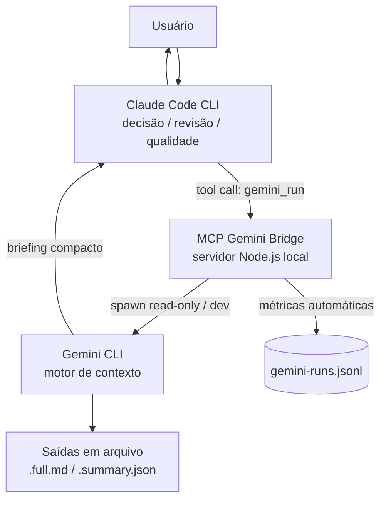

# Arquitetura — Context Bridge Lab

## Visão de duas camadas

O sistema separa **decisão** (Claude) de **execução/contexto** (Gemini), com o MCP no meio
fazendo a ponte e registrando métricas.

### Camada Claude (política)

Definida em `CLAUDE.md`. Responsável por classificar a tarefa, decidir o que delegar, revisar o
retorno do Gemini, manter segurança/arquitetura e gerar handoffs. Lida automaticamente por
qualquer sessão do Claude Code aberta na pasta.

### Camada MCP (execução)

Servidor Node.js (`server/index.js`) que expõe as ferramentas `gemini_run` e `gemini_cwd`.
Ele executa o Gemini, filtra o contexto (devolve briefing + metadados em vez de material bruto)
e grava métricas a cada execução.

### Gemini (motor de contexto)

Faz a leitura/pesquisa/análise pesada e, em modo de desenvolvimento, pode implementar tarefas
simples. Opera em modo somente-leitura por padrão.

## Regra fundamental

> **Claude decide. Gemini executa. MCP registra.**

## Modos de operação

| Modo          | Gemini              | `approval_mode` padrão | Uso                                         |
| ------------- | ------------------- | ---------------------- | ------------------------------------------- |
| `research`    | somente leitura     | `plan`                 | análise, pesquisa, documentação, mapeamento |
| `development` | cria/edita arquivos | `auto_edit`            | frontend simples, CRUD, testes, protótipos  |

Em ambos os modos, o Claude sempre revisa antes de aprovar.

> **Limitação de segurança — `research` é read-only por política, não por sandbox.**
> O modo `research` é uma **garantia operacional/instrucional**: o Gemini é instruído a não
> modificar arquivos e roda com `approval_mode=plan`. Não há isolamento real de sistema de
> arquivos. Para tornar isso verificável, o servidor mede o estado do `git` antes e depois de
> cada execução e registra os arquivos realmente alterados (veja "Métricas automáticas").

### Proteção do modo `yolo`

O modo `yolo` (Gemini executa tudo sem confirmação) fica **desabilitado por padrão**. Ele só é
aceito quando a variável de ambiente `ALLOW_GEMINI_YOLO=1` está presente; caso contrário, o
servidor recusa a execução com erro explícito. `plan`, `default` e `auto_edit` permanecem
disponíveis normalmente.

## A ferramenta `gemini_run`

Parâmetros relevantes: `prompt`, `mode`, `task_type`, `output_file`, `summary_file`, `cwd`,
`approval_mode`, `timeout_ms`, `user_language`, `task_id`, `project`, `record_metrics`.

- Com `output_file`, o Claude recebe um **envelope** (briefing + metadados); o relatório completo
  fica salvo em arquivo.
- Sem `output_file`, o retorno é o texto do Gemini, limitado a um teto inline.
- O Gemini não recebe instruções sobre "papel hierárquico" — isso é responsabilidade do Claude.

## Métricas automáticas

Cada execução gera uma linha em `docs/gemini-output/_metrics/gemini-runs.jsonl` com:
`task_id`, `task_type`, `mode`, `status`, `started_at`, `finished_at`, `duration_seconds`,
`files_created`, `files_modified`, `files_deleted`, `git_evidence`, `files_declared_by_gemini`,
`review_required`.

**Evidência real de mudanças (via git).** Antes e depois de executar o Gemini, o servidor captura
`git status --porcelain` e, ao final, `git diff --name-only` e `git diff --stat`. A lista de
arquivos alterados é derivada **primeiro dessa evidência** e só então complementada pelo que o
Gemini declarou no briefing. Se a pasta não for um repositório git, o servidor cai graciosamente
para o briefing (`git_evidence.available: false`), sem quebrar a execução.

> As saídas em `docs/gemini-output/` são geradas localmente e ficam fora do controle de versão.

## Nota de compatibilidade (Windows)

No Windows com Node 18.20+/20.12+/22+, o `spawn` direto de arquivos `.cmd` com `shell:false`
gera `spawn EINVAL`. O bridge resolve isso executando o bundle `gemini.js` diretamente via Node
(mantendo `shell:false`), evitando `shell:true` e o risco de injeção.
